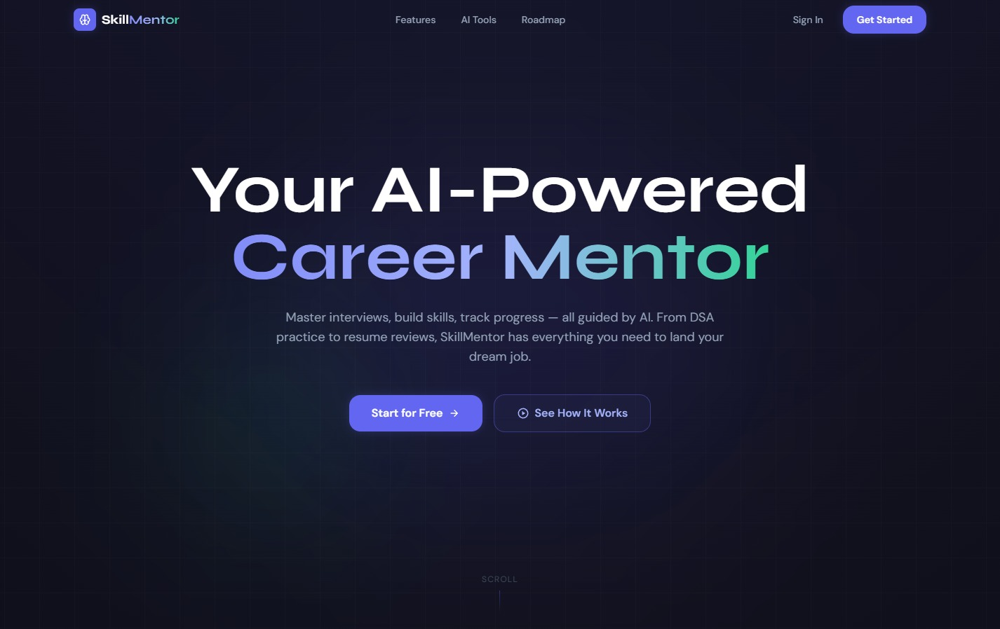
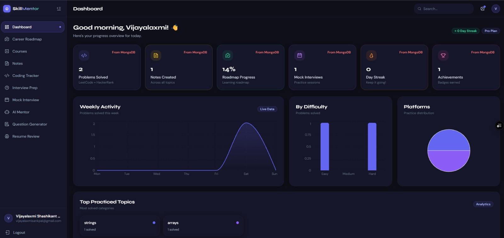
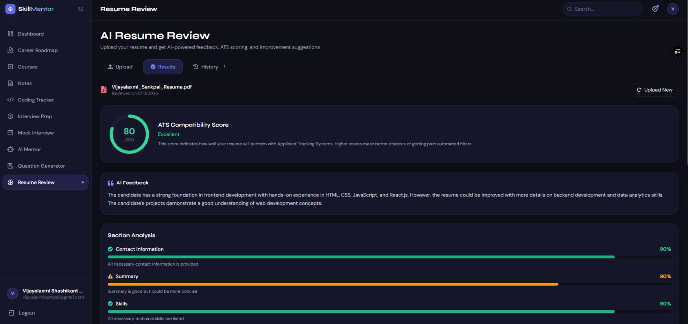
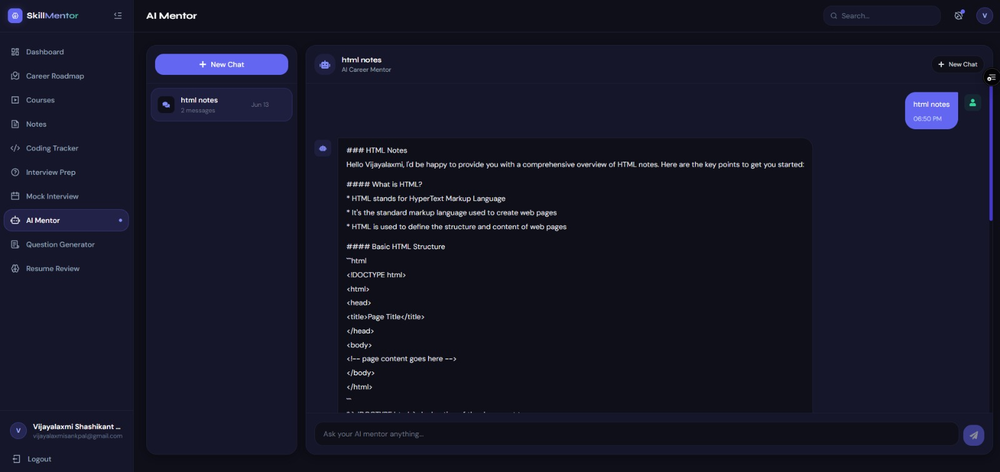
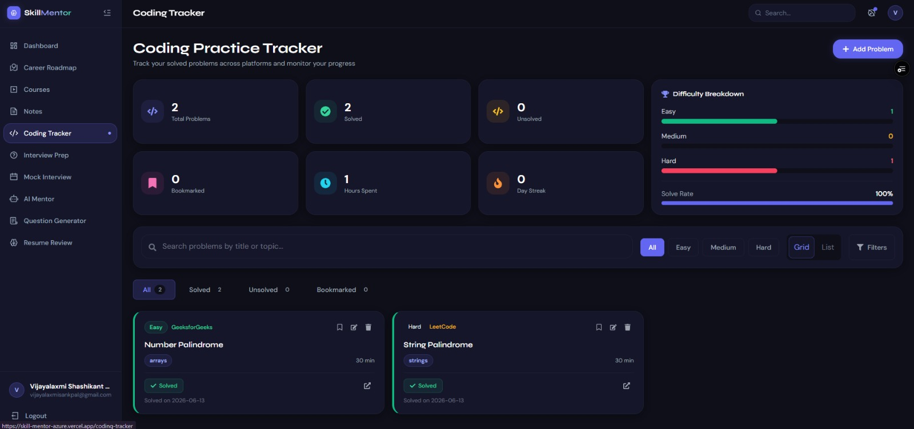
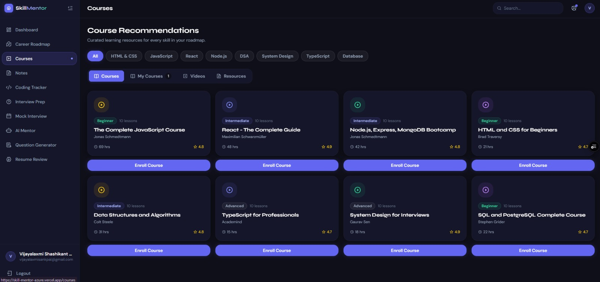

# 🚀 SkillMentor AI

<div align="center">


### AI-Powered Career Development Platform

Helping students prepare for jobs through AI-powered resume analysis, interview preparation, coding practice, career roadmaps, progress tracking, and personalized learning.

🌐 **Live Demo:** https://skill-mentor-azure.vercel.app/

</div>

---

# 📖 Overview

SkillMentor AI is a full-stack MERN application designed to help students and aspiring professionals prepare for their careers using Artificial Intelligence.

Instead of relying on multiple disconnected platforms, SkillMentor brings everything together in one place—from resume analysis and interview preparation to coding practice, learning management, and career tracking.

The platform combines modern web technologies with AI to provide a personalized learning experience while helping users monitor their progress through an intuitive analytics dashboard.

---

# ✨ Key Features

## 🤖 AI Features

- AI Resume Review
- Resume ATS Analysis
- AI Interview Preparation
- AI Career Guidance
- Personalized Learning Suggestions

---

## 📚 Learning Features

- Coding Practice Tracker
- Career Roadmaps
- Course Enrollment
- Course Progress Tracking
- Notes Management
- Learning Dashboard

---

## 📊 Analytics

- Progress Dashboard
- Learning Statistics
- Coding Activity
- Achievement Tracking
- Streak System
- Performance Insights

---

## 🔐 Authentication

- Email Registration
- Secure Login
- JWT Authentication
- Protected Routes
- User Profile Management

---

# 📸 Application Screenshots

## 🏠 Home Page



---

## 📊 Dashboard



---

## 📄 AI Resume Review



---

## 🎤 AI Mentor



---

## 💻 Coding Tracker



---

## 🛣 Courses



---

# 🏗 System Architecture

```text
                 User

                   │

                   ▼

          React + Vite Frontend

                   │

        REST API Requests (Axios)

                   │

                   ▼

          Node.js + Express API

                   │

      Authentication (JWT)

                   │

                   ▼

             MongoDB Database

                   │

                   ▼

             Grok AI Services
```

---

# 🛠️ Technology Stack

## Frontend

| Technology | Purpose |
|------------|---------|
| React.js | User Interface |
| Vite | Fast Development Environment |
| React Router | Client-side Routing |
| Axios | API Communication |
| CSS | Styling |

---

## Backend

| Technology | Purpose |
|------------|---------|
| Node.js | Runtime Environment |
| Express.js | REST API |
| MongoDB | Database |
| Mongoose | ODM |
| JWT | Authentication |
| bcrypt | Password Hashing |

---

## AI Integration

- Grok AI
- Resume Analysis
- Career Guidance
- Interview Assistance

---

# 📁 Project Structure

```text
SkillMentor
│
├── frontend
│   ├── public
│   ├── src
│   │   ├── assets
│   │   ├── components
│   │   ├── pages
│   │   ├── services
│   │   ├── hooks
│   │   ├── context
│   │   └── utils
│   │
│   ├── package.json
│   └── vite.config.js
│
├── backend
│   ├── controllers
│   ├── middleware
│   ├── models
│   ├── routes
│   ├── services
│   ├── utils
│   ├── package.json
│   └── server.js
│
├── Screenshots
│
└── README.md
```

---

# ⚙️ Installation

## Clone Repository

```bash
git clone https://github.com/VijayalaxmiSankpal/SkillMentor.git
```

---

## Install Frontend

```bash
cd frontend
npm install
npm run dev
```

---

## Install Backend

```bash
cd backend
npm install
npm start
```

---

# 🔑 Environment Variables

Backend

```env
PORT=

MONGODB_URI=

JWT_SECRET=

GROK_API_KEY=

EMAIL_USER=

EMAIL_PASSWORD=
```

---

# 🔐 Authentication

- Email Registration
- Secure Login
- Password Hashing
- JWT Authentication
- Protected Routes
- User Sessions

---

# 📡 API Modules

- Authentication
- Resume
- Dashboard
- Coding Tracker
- Courses
- Career Roadmap
- Notes
- AI Services

---

# 🚀 Deployment

## Frontend

The frontend is deployed on **Vercel**.

🌐 Live Demo

https://skill-mentor-azure.vercel.app/

---

## Backend

The backend is deployed on **Render** and provides REST APIs for authentication, AI features, dashboard analytics, and data management.

---

# 🎯 Core Modules

## 👤 User Management

- User Registration
- Login
- Profile Management
- Secure Authentication

---

## 📄 Resume Module

- Resume Upload
- AI Resume Review
- Resume Improvement Suggestions

---

## 💻 Coding Practice

- Track Coding Progress
- Daily Practice
- Coding Statistics
- Progress Visualization

---

## 🎓 Learning

- Course Management
- Notes
- Learning Progress
- Personalized Dashboard

---

## 🛣 Career Roadmaps

- Structured Learning Paths
- Technology Roadmaps
- Progress Tracking

---

## 🤖 AI Assistant

SkillMentor uses AI to help users with:

- Resume Improvement
- Interview Preparation
- Career Guidance
- Learning Recommendations

---

# 📈 Future Improvements

- Google Authentication
- Company Hiring Portal
- Mock Coding Interviews
- Real-time Notifications
- AI Career Matching
- Resume Version History
- Community Discussion Forum
- Mobile Application

---

# 🤝 Contributing

Contributions are welcome.

If you would like to improve SkillMentor:

1. Fork the repository

2. Create a new branch

```bash
git checkout -b feature-name
```

3. Commit changes

```bash
git commit -m "Add feature"
```

4. Push branch

```bash
git push origin feature-name
```

5. Open a Pull Request

---

# 📜 License

This project is licensed under the MIT License.

---

# 👩‍💻 Author

## Vijayalaxmi Sankpal

Aspiring Data Analyst & Full Stack Developer

GitHub

https://github.com/VijayalaxmiSankpal

LinkedIn

https://www.linkedin.com/in/vijayalaxmi-sankpal-b99b4a25b

Email

vijayalaxmisankpal@gmail.com

---

# ⭐ If you found this project useful

Please consider giving it a ⭐ on GitHub.

It helps others discover the project and motivates future improvements.

---

<div align="center">

### Thank you for visiting SkillMentor AI ❤️

Building smarter careers with AI.

</div>